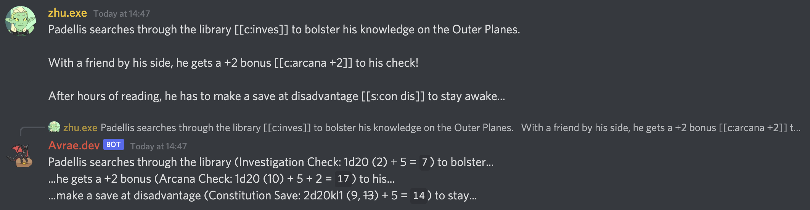

.. _inline_rolling:

Inline Rolling
==============

Whenever you send a message with some dice in between double brackets (e.g. ``[[1d20]]``),
Avrae will reply to it with a roll for each one. You can send messages with multiple, too, for example:

.. code-block:: text

    I attack the goblin with my shortsword [[1d20 + 6]] for a total of [[1d6 + 3]] piercing damage.

Enabling Inline Rolling
-----------------------
By default, inline rolling is disabled when Avrae first joins a server. To enable Inline Rolling, a server admin
(i.e. any member with the Manage Server permission) can enable it using the ``!servsettings`` command.

Select ``Inline Rolling Settings`` in the menu, and select whether to use reaction-based rolling or always-on rolling.

Always-On Rolling
^^^^^^^^^^^^^^^^^
When Avrae detects an inline roll in a message, she will immediately reply with the roll results for each roll in
the message.

Reaction-Based Rolling
^^^^^^^^^^^^^^^^^^^^^^
When Avrae detects an inline roll in a message, she will react to the message with the 🎲 emoji. The message author
can then react to have Avrae reply with the roll results for each roll in the message. Other users' reactions and
any of the author's reactions beyond the first will be ignored.

Arguments
---------
Inline Rolling supports the ``adv`` and ``dis`` arguments in the same manner as the ``!r`` command.

Comments
--------
Inline Rolling supports comments similar to the ``!r`` command.

If a comment is supplied, the output will display the comment *instead* of the message context surrounding the roll.

Character Rolls
---------------
If an inline roll starts with ``c:`` or ``s:``, the roll will use your active character's check or save dice for the
given skill, respectively. This roll type can be combined with other dice bonuses or the advantage arguments.

Examples
--------

+-----------------------+-------------------------------------------------------------+
| Message               | Description                                                 |
+=======================+=============================================================+
| ``[[1d20]]``          | Rolls 1d20.                                                 |
+-----------------------+-------------------------------------------------------------+
| ``[[1d20+5 adv]]``    | Rolls a d20 at advantage with a +5 bonus.                   |
+-----------------------+-------------------------------------------------------------+
| | ``[[4d6kh3 STR]]``  | Rolls 6 sets of 4d6, keeping the highest 3 die of each set. |
| | ``[[4d6kh3 DEX]]``  |                                                             |
| | ``[[4d6kh3 CON]]``  |                                                             |
| | ``[[4d6kh3 INT]]``  |                                                             |
| | ``[[4d6kh3 WIS]]``  |                                                             |
| | ``[[4d6kh3 CHA]]``  |                                                             |
+-----------------------+-------------------------------------------------------------+
| ``[[c:arc]]``         | Rolls an arcana check for the current active character.     |
+-----------------------+-------------------------------------------------------------+
| ``[[s:dex]]``         | Rolls a dexterity save for the current active character.    |
+-----------------------+-------------------------------------------------------------+
| ``[[c:pers adv]]``    | Rolls a persuasion check at advantage.                      |
+-----------------------+-------------------------------------------------------------+
| ``[[s:con-2]]``       | Rolls a constitution save with a -2 penalty.                |
+-----------------------+-------------------------------------------------------------+
| ``[[s:str+1d4 adv]]`` | Rolls a strength save with a +1d4 bonus at advantage.       |
+-----------------------+-------------------------------------------------------------+
